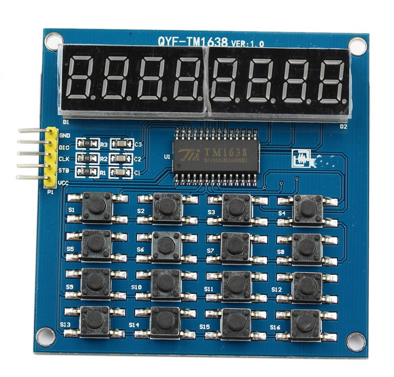

# Reloj de Ajedrez - Monitor 6502 + TM1638 + SID

Reloj de ajedrez digital para dos jugadores con sonido, basado en el **Monitor 6502** corriendo en una **Tang Nano 9K**, usando el módulo **TM1638** (display 8 dígitos + 16 botones) y chip de sonido **SID 6581**.



## Características

- 🕐 **Dos jugadores** con tiempos independientes y cuenta regresiva
- 👁️ **Display simultáneo**: muestra ambos tiempos en 8 dígitos
- 🔊 **Sonido SID**: efectos por teclas, turnos, advertencias y game over
- 💤 **Parpadeo inteligente**: el jugador en espera titila suavemente
- ⚙️ **Tiempo configurable**: de 1 a 99 minutos
- ⏸️ **Pausa/Reanudar**: sin perder los tiempos
- 🔄 **Reinicio**: vuelve al tiempo configurado
- ⏰ **Alarma**: beep en los últimos 10 segundos
- 🎮 **Game Over**: detecta tiempo agotado con sonido y mensaje en display
- 📟 **Registro UART**: cada movimiento se muestra por terminal
- ⌨️ **Comando 'q'**: salir al monitor 6502

## Hardware Requerido

| Componente | Descripción |
|------------|-------------|
| **Tang Nano 9K** | FPGA con Monitor 6502 v2.2.0+ |
| **Módulo TM1638** | QYF-TM1638: 8 dígitos + 16 botones |
| **SID 6581/8580** | Chip de sonido (o implementación FPGA en $D400) |
| **Cables** | Para conectar TM1638 y SID (si es externo) |
| **Terminal UART** | Para ver el registro de movimientos |

### Configuración de Pines

**TM1638** — Conectado al puerto **0xC000**:

| Bit | Pin | Función |
|-----|-----|---------|
| Bit 0 | CLK | Señal de reloj |
| Bit 1 | DIO | Datos bidireccional |
| Bit 2 | STB | Selección de chip |

**SID 6581** — Mapeado en **$D400** (estándar Commodore 64):

| Dirección | Función |
|-----------|---------|
| $D400-$D406 | Voz 1 (frecuencia, PW, control, ADSR) |
| $D407-$D40D | Voz 2 (frecuencia, PW, control, ADSR) |
| $D40E-$D414 | Voz 3 (frecuencia, PW, control, ADSR) |
| $D415-$D418 | Filtro y volumen |

## Distribución del Teclado TM1638

```
[ 1] [ 2] [ 3] [P1]  ← P1 (4)  = Finalizar turno Jugador 1
[ 5] [ 6] [ 7] [P2]  ← P2 (8)  = Finalizar turno Jugador 2
[ 9] [10] [11] [RST] ← RST(12) = Reiniciar partida
[ -] [ 0] [PAU] [SET]← PAU(15) = Pausa/Reanudar
                         SET(16) = Configuración (mantener 1s)
                         INC(10) = + en configuración
                         DEC( 9) = - en configuración
```

## Display

Los 8 dígitos muestran ambos tiempos simultáneamente. El punto decimal (DP) en las unidades de minutos separa MM:SS de cada jugador:

```
05.00 05.00
^^^^    ^^^^
 P1      P2

Normal:    "05.00 05.00"  →  P1: 05:00 | P2: 05:00
Parpadeo:   "05.00" fijo, "    " titila  →  el que espera titila
Config:    "SET  05  "    →  Configurando tiempo
Pausa:     " PAUSADO "    →  Partida pausada
Game Over: "P1 TIME!"     →  Jugador 1 perdió
           "P2 TIME!"     →  Jugador 2 perdió
```

## Sonidos SID

| Evento | Sonido | Descripción |
|--------|--------|-------------|
| Presionar P1/P2/RST | Click | Ruido blanco (NOISE C7), muy corto |
| Cambio de turno | Tono | Onda triangular (TRIANGLE A5) |
| Últimos 10s | Beep | Onda pulsada (PULSE C7) cada segundo |
| Game Over | Acorde grave | 2 voces (SAWTOOTH C3 + G3) |
| Pausa | Tono C5 | Onda triangular suave |
| Reanudar | Tono E5 | Onda triangular suave |

## Cómo usar

### 1. Iniciar

Cargar el programa en el monitor 6502:
```
LOAD CHESS 0800
R 0800
```

El display muestra `CHESS1.0` y luego `05.00 05.00` (5 min por jugador).

### 2. Empezar partida

Presione **P1** o **P2**. El reloj del Jugador 1 arranca la cuenta regresiva. Se escucha un **click** y un **tono** de cambio de turno.

### 3. Alternar turnos

El jugador activo presiona su botón (**P1** o **P2**) para detener su reloj e iniciar el del oponente. El jugador en espera titila suavemente (500ms visible / 150ms oculto).

### 4. Pausa

Presione **PAU** para pausar. Se muestra ` PAUSADO ` y suena un tono. Presione otra vez para reanudar.

### 5. Configurar tiempo

Mantenga presionado **SET** por 1 segundo. Use **+ (10)** y **- (9)** para ajustar los minutos (1-99). Presione **SET** nuevamente para guardar y volver.

### 6. Reiniciar

Presione **RST** para reiniciar ambos relojes al tiempo configurado.

### 7. Salir

Escriba `q` (sin Enter) en la terminal UART para volver al monitor. El SID se silencia y el display se apaga.

## Registro UART

Cada movimiento se registra automáticamente:

```
================================================
  Reloj de Ajedrez - Monitor 6502
  Version 1.0.0
================================================
Teclado TM1638:
  [ 1] [ 2] [ 3] [P1]    P1 = Jugador 1
  [ 5] [ 6] [ 7] [P2]    P2 = Jugador 2
  [ 9] [10] [11] [RST]   RST = Reiniciar
  [ -] [ 0] [PAU] [SET]  PAU = Pausa, SET = Config
  9(-) y 10(+) ajustan tiempo en config
Mantener SET 1s = Configuracion
Escriba 'q' para salir

-- Reloj de Ajedrez iniciado --
Tiempo: 05:00 por jugador
Presione P1 o P2 para iniciar
-- Partida iniciada --
Jugador 1: 05:00  Jugador 2: 05:00
Turno del Jugador 1
Jugador 1 presiona - Turno del Jugador 2 (P1:04:47  P2:05:00)
Jugador 2 presiona - Turno del Jugador 1 (P1:04:47  P2:04:52)
-- Partida pausada --
-- Partida reanudada --
*** Jugador 1 se quedo sin tiempo!
-- Fin de la partida --
```

## Estados del Reloj

| Estado | Display | Sonido | Descripción |
|--------|---------|--------|-------------|
| `STOPPED` | `05.00 05.00` | — | Esperando iniciar |
| `RUNNING` | `04.30 05.00` (P1 titila) | Click + tono turno | Partida en curso |
| `PAUSED` | ` PAUSADO ` | Tono C5 | Ambos detenidos |
| `SETTINGS` | `SET  05  ` | — | Configurando tiempo |
| `GAME_OVER` | `P1 TIME!` | Acorde grave (C3+G3) | Tiempo agotado |

## Precisión

El reloj usa un tick de 50ms y cuenta 20 iteraciones = 1 segundo. El overhead del loop (UART, teclas, parpadeo) es mínimo y consistente, dando una precisión mejor que ±1s por minuto, más que suficiente para ajedrez.

## Estructura del Proyecto

```
RelojAjedrez/
├── src/
│   ├── main.c               # Código principal del reloj de ajedrez
│   └── startup.s            # Código de inicio del runtime C
├── include/
│   └── romapi.h             # Definiciones de ROM API
├── config/
│   └── programa.cfg         # Configuración del linker
├── libs/
│   ├── tm1638-6502-cc65/    # Librería TM1638 (display + teclado)
│   └── 6581_SID-6502-cc65/  # Librería SID 6581 (sonido)
├── docs/
│   └── images/
│       └── tm1638-7.png     # Imagen del módulo TM1638
├── build/                   # Archivos objeto (generados)
├── output/                  # Binario final (generado)
├── makefile                 # Script de compilación
├── README.md                # Este archivo
└── MANUAL.md                # Manual de usuario
```

## Dependencias

- **CC65** — Compilador C para 6502
- **Monitor 6502 v2.2.0+** — ROM API (UART, timer)
- **Librería TM1638** — `../../libs/tm1638-6502-cc65`
- **Librería SID 6581** — `../../libs/6581_SID-6502-cc65`

## Compilación

```bash
make        # Compilar
make clean  # Limpiar
make info   # Ver tamaño del binario
```

El binario se genera en `output/chess-clock.bin` (~9.5KB).

## Instalación en la Tang Nano 9K

### Vía SD Card
1. Copiar `output/chess-clock.bin` a la SD Card como `CHESS`
2. En el monitor:
```
LOAD CHESS 0800
R 0800
```

### Vía XMODEM
```
XRECV 0800
R 0800
```

## Licencia

MIT
